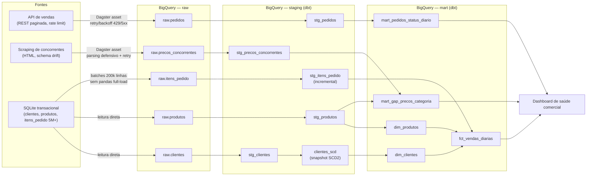

# Pipeline ELT — Saúde Comercial

Pipeline que consolida 3 fontes heterogêneas de dados comerciais (API de vendas,
scraping de preços de concorrentes e um banco transacional SQLite) em um data
warehouse em camadas no BigQuery (`raw` → `staging` → `mart`), orquestrado com
Dagster e modelado com dbt, para alimentar um dashboard diário de "saúde comercial".

## Arquitetura



GCS (`gs://vena-teste-candidato-ae-brayan`) é usado como landing zone
intermediária: cada asset raw escreve Parquet no bucket antes do load job do
BigQuery (necessário para o load de arquivo e para a estratégia de streaming
em batches de `itens_pedido`).

## Camadas

- **raw** — dado como a fonte devolveu, sem limpeza (inclusive sujo/nulo/duplicado
  de propósito). Tabelas particionadas por `_ingestion_date`; cada carga usa
  `WRITE_TRUNCATE` só na partição do dia, então rodar duas vezes no mesmo dia
  substitui em vez de duplicar.
- **staging** (dbt) — dedup, tipagem, normalização. `stg_itens_pedido` é um
  modelo **incremental** (`merge` por `item_id`) para não reprocessar os 5M+
  linhas inteiras a cada run. `clientes_scd` é um **snapshot SCD2** (dbt
  `check` strategy) que guarda o histórico de mudanças de cliente entre execuções.
- **mart** (dbt) — `fct_vendas_diarias` (grão dia × categoria × segmento, a
  partir de `itens_pedido`), `mart_pedidos_status_diario` (funil da API por
  dia/status) e `mart_gap_precos_categoria` (preço médio interno vs.
  concorrência, por categoria).

## Decisões e trade-offs

- **Por que dois marts de "pedidos" separados em vez de um join único?**
  `itens_pedido` (SQLite, 5M linhas) e `pedidos` (API, 48k registros) têm
  `pedido_id` no mesmo formato, mas são datasets sintéticos independentes do
  case — não há garantia de que representem o mesmo universo de pedidos.
  Forçar um join 1:1 por `pedido_id` entre os dois criaria uma relação
  artificial. Optei por tratar `itens_pedido` como a fonte primária do fato
  transacional (`fct_vendas_diarias`) e a API como uma fatia própria do funil
  de pedidos (`mart_pedidos_status_diario`), documentando a limitação em vez
  de mascará-la com um join que não seria semanticamente correto.
- **Por que o gap de preços é por categoria, não por produto?** Os nomes de
  produto do scraping (ex: "Tênis Runner Pro") não têm nenhuma correspondência
  com os nomes do catálogo interno (ex: "Repudiandae Repellendus", claramente
  gerado por lorem ipsum) — são datasets sintéticos desconectados. Um
  matching produto-a-produto exigiria um passo de fuzzy matching fora do
  escopo do case. Comparar preço médio por categoria é a granularidade que a
  informação disponível realmente sustenta, sem fabricar uma chave que não existe.
- **Streaming do SQLite sem pandas para `itens_pedido`.** 5M linhas não cabem
  confortavelmente num `pandas.read_sql` de uma vez. `raw_itens_pedido` lê via
  `sqlite3.Cursor.fetchmany(200_000)` em loop, grava cada batch como um
  arquivo Parquet próprio (`pyarrow`, sem pandas) e sobe pro GCS imediatamente
  — a memória do processo nunca ultrapassa o tamanho de um batch. Um único
  load job do BigQuery lê todos os arquivos do prefixo via wildcard no final.
- **Retry-After real em vez de backoff cego.** A API de vendas não tem rate
  limit aleatório: são exatamente 30 requests liberadas, depois um `429` com
  header `Retry-After` fixo (~56s) até a janela resetar (medido empiricamente
  contra o serviço). O cliente HTTP honra esse header diretamente em vez de
  adivinhar com backoff exponencial — mais rápido e mais correto que um
  retry genérico.
- **Parsing do scraping em estratégias em cascata.** A página muda de
  estrutura a cada request. O parser tenta 3 estratégias (atributos
  `data-product`, tabela genérica, cards genéricos por heurística de preço) e
  só levanta exceção se nenhuma extrair nada — o que aciona o `RetryPolicy`
  do Dagster (a próxima tentativa tem uma estrutura nova, com chance real de
  ser parseável) em vez de derrubar o pipeline inteiro.
- **Testes de integridade referencial como `warn`, não `error`.** O SQLite
  fornecido tem "chaves quebradas" propositalmente. Testes `relationships`
  como erro bloqueante fariam o `dbt build` falhar sempre, escondendo sinal
  real atrás de um problema conhecido e esperado — por isso ficam como aviso
  visível, não como falha de build.
- **Dataset único do BigQuery para as 3 camadas.** O escopo de acesso da
  service account é limitado a um único dataset
  (`teste_tecnico_ae_brayan`). As camadas são distinguidas por convenção de
  nome de tabela (`raw.*`, `stg_*`, `dim_*`/`fct_*`/`mart_*`), não por
  datasets separados do BigQuery.

## Idempotência

- **raw**: partição por `_ingestion_date` com `WRITE_TRUNCATE` restrito à
  partição do dia — rodar duas vezes no mesmo dia substitui, não duplica.
- **staging/mart**: `stg_itens_pedido` é incremental com `merge` por
  `item_id`; as demais views/tabelas são recalculadas de forma determinística
  a partir da staging a cada `dbt build`.

**Verificado de verdade** (não só na teoria): o pipeline completo foi
executado duas vezes seguidas contra o projeto GCP real do case
(`vena-teste.teste_tecnico_ae_brayan`), e as contagens de linha ficaram
idênticas em todas as camadas entre a 1ª e a 2ª execução:

| Tabela | 1ª execução | 2ª execução |
| --- | ---: | ---: |
| `raw.clientes` | 6.180 | 6.180 |
| `raw.produtos` | 800 | 800 |
| `raw.pedidos` | 48.000 | 48.000 |
| `raw.itens_pedido` | 5.000.000 | 5.000.000 |
| `stg_itens_pedido` (incremental) | 5.000.000 | 5.000.000 |
| `clientes_scd` (snapshot SCD2) | 6.168 | 6.168 |
| `dim_clientes` | 6.168 | 6.168 |
| `fct_vendas_diarias` | 11.520 | 11.520 |
| `mart_pedidos_status_diario` | 2.184 | 2.184 |
| `mart_gap_precos_categoria` | 16 | 16 |

(`clientes_scd`/`dim_clientes` têm menos linhas que `raw.clientes` porque a
staging deduplica ~12 `cliente_id` repetidos na origem antes do snapshot.)

## Observabilidade

- Logs estruturados via `context.log` em cada asset (linhas processadas,
  páginas lidas, batches enviados, taxa de nulos).
- `context.add_output_metadata` expõe métricas (linhas carregadas, contagem de
  nulos, output do load job) na UI do Dagster para cada materialização.
- **Asset checks** (`dagster_project/checks/quality_checks.py`) validam, contra
  o dado já carregado no BigQuery (não só o metadata em memória): volume
  mínimo do scraping, taxa de nulos em campos críticos de `pedidos`, volume de
  `itens_pedido` comparado ao esperado (~5M), e presença de linhas em
  `clientes`/`produtos`.

## Como rodar

```bash
python -m venv .venv
.venv\Scripts\pip install -r requirements.txt
copy .env.example .env   # preencha com os valores do ambiente fornecido

# gera o manifest do dbt (necessário antes da primeira execução via Dagster)
cd dbt_project && ..\.venv\Scripts\dbt parse && cd ..

# UI local do Dagster (recomendado — materializar tudo pela UI)
.venv\Scripts\dagster dev -m dagster_project.definitions

# ou via CLI (no PowerShell, "*" é expandido pelo shell como glob de arquivos
# — liste os assets explicitamente em vez de usar --select "*"):
.venv\Scripts\dagster asset materialize -m dagster_project.definitions --select `
  raw_clientes,raw_produtos,raw_pedidos,raw_precos_concorrentes,raw_itens_pedido,`
  stg_clientes,stg_produtos,stg_pedidos,stg_itens_pedido,stg_precos_concorrentes,`
  clientes_scd,dim_clientes,dim_produtos,fct_vendas_diarias,`
  mart_pedidos_status_diario,mart_gap_precos_categoria

# testes
.venv\Scripts\pytest tests\ -v
```

## Uso de IA no desenvolvimento

- **Ferramenta**: Claude Code (agente de codificação da Anthropic), usado do
  início ao fim — geração do código, execução de comandos, e validação
  contra o ambiente GCP real fornecido.
- **Metodologia**: spec-first, não iterativo-às-cegas. Antes de escrever
  qualquer código, o agente leu os 3 documentos de instrução, inspecionou o
  schema real do SQLite e fez chamadas reais às duas APIs para entender o
  formato de dado antes de desenhar a arquitetura. A arquitetura completa
  (camadas, estratégia de streaming, dbt vs. SQL puro, estrutura de pastas)
  foi escrita como um plano revisado e aprovado explicitamente antes de
  qualquer implementação — inclusive com perguntas diretas sobre decisões que
  cabiam a mim (setup de Git local, dbt vs. SQL puro, local do projeto).
- **Revisão do código gerado**: não foi "gerou e confiou". Cada asset foi
  de fato executado contra o projeto GCP real (BigQuery + GCS) fornecido no
  case, não só lido/inspecionado — e isso encontrou bugs reais que uma
  revisão só de leitura não pegaria:
  - `from __future__ import annotations` quebrava a detecção de parâmetro
    `context` do Dagster (anotações viravam string, Dagster não reconhecia a
    classe) — removido dos módulos de asset.
  - `profiles.yml` do dbt tinha uma chave duplicada (`timeout_seconds` e
    `job_execution_timeout_seconds` mapeiam para a mesma config na versão do
    dbt instalada) — só apareceu ao rodar `dbt parse` de verdade.
  - Particionamento do BigQuery exige coluna `DATE`/`TIMESTAMP`, e a primeira
    versão gravava `_ingestion_date` como string — só deu erro ao tentar
    carregar de verdade (`400 BadRequest`).
  - O rate limit da API não é aleatório: são exatamente 30 requests seguidos
    e depois um `429` com `Retry-After` fixo (~56s) até resetar. Isso só foi
    descoberto testando diretamente contra o serviço (`Invoke-WebRequest` em
    loop) — o código inicial usava backoff exponencial genérico, que
    funcionava mas era mais lento e menos correto que simplesmente honrar o
    header que o servidor já manda.
  - O campo `valor_unitario` da API vem misto: `float` na maioria dos
    registros, mas `"462.99 BRL"` (string) em alguns. Isso quebrava
    `pyarrow.Table.from_pylist` com um erro genérico e pouco claro. Escrevi
    um script (`scripts/diagnose_pedidos_types.py`) que varre os 48.000
    registros reais e reporta, por coluna, quais tipos Python aparecem — foi
    assim que a causa raiz foi confirmada (e não por tentativa e erro no
    código do pipeline).
  - Um teste `not_null` no mart de pedidos por dia falhou porque alguns
    pedidos vêm da API sem `data_pedido` — dado sujo real, não um bug de
    código. A decisão de excluir esses registros do grão diário (em vez de
    simplesmente relaxar o teste) foi deliberada, documentada no modelo.
  - No Windows PowerShell, `dagster asset materialize --select "*"` faz o
    shell expandir `*` como glob de arquivos do diretório — só percebido ao
    rodar o comando de verdade; a solução foi listar os assets
    explicitamente.

  Nenhum desses bugs seria pego só lendo o código gerado — todos vieram de
  efetivamente rodar o pipeline contra a API, o scraping e o BigQuery reais,
  olhar o erro, e corrigir a causa raiz (não o sintoma).
- **Testes**: escritos junto com cada módulo de lógica pura (parsing do
  scraping, retry HTTP, leitura em batches do SQLite), não estritamente
  TDD (teste antes do código), mas validados via `pytest` antes de cada
  materialização real contra o GCP — inclusive um teste de regressão
  específico para o bug do `valor_unitario` misto, escrito depois de
  encontrar o problema, para não reintroduzi-lo.
- **O que não foi delegado**: as decisões de arquitetura e trade-off
  documentadas na seção acima (por que dois marts de pedidos em vez de um
  join único, por que o gap de preço é por categoria e não por produto, por
  que testes de integridade referencial ficam como `warn`, por que raw usa
  particionamento por ingestão em vez de outra estratégia) foram raciocinadas
  e decididas explicitamente, não aceitas como a primeira sugestão gerada.
  A leitura e validação de cada erro real contra o ambiente GCP fornecido —
  e a interpretação de qual era a causa raiz versus qual era só sintoma —
  também foi feita a cada etapa, não delegada.
